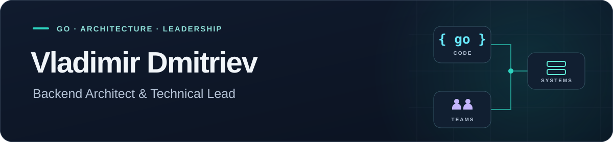

  

  
  
  

  
  
  
  

  I design reliable backend systems and help engineering teams deliver them. 
  My background spans Python development, Go engineering, and technical leadership.

## What I work on

- 🧩 **Backend architecture:** service boundaries, API contracts, and integration across isolated network zones.
- ⚙️ **Hands-on Go engineering:** backend services, shared libraries, and practical developer tooling.
- 🛠️ **Engineering foundations:** service templates, CI/CD, observability, and standards that support team autonomy.
- 🧭 **Technical leadership:** growing Go teams, defining ownership, and connecting architectural decisions with implementation.

---

  <a href="https://v0hmly.dev">v0hmly.dev</a> ·
  <a href="https://t.me/v0hmly">Telegram</a> ·
  <a href="https://www.linkedin.com/in/v0hmly/">LinkedIn</a>

